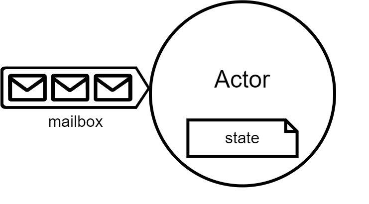

**Domain Driven Design**
w/ Actor Model
=====

---

## **Domain Driven Design**
<!-- _footer: "" -->

- 전략적 설계 (Strategic Design)
- 전술적 설계 (Tactical Design)
   - 엔터티 (Entity)
   - 값 개체 (Value Object)
   - 집계 (Aggregate)
   - 팩토리 (Factory)
   - 저장소 (Repository)
---

## **엔터티 (Entity)**
<!-- _footer: "" -->

- 식별자 (ID)
- 다른 엔터티의 ID와 VO를 속성으로 가짐
- 행위가 속성보다 중요
- 순환 참조하지 말것

---

## **값 개체 (Value Object)**
<!-- _footer: "" -->

- 불변
- 속성기반 비교

---

## **집계 (Aggregate)**
<!-- 
_footer: "[1] 도메인 주도 설계 첫걸음"
-->

- 집계는 엔터티(Entity) 이다. [1]
- DB 트랜젝션의 단위
- unit of work 단위
- 집계간의 협업을 통해 비즈니스를 처리

---

## **Actor Model**

---
## Slide Two

- Dog
- Cat
- Frog
---